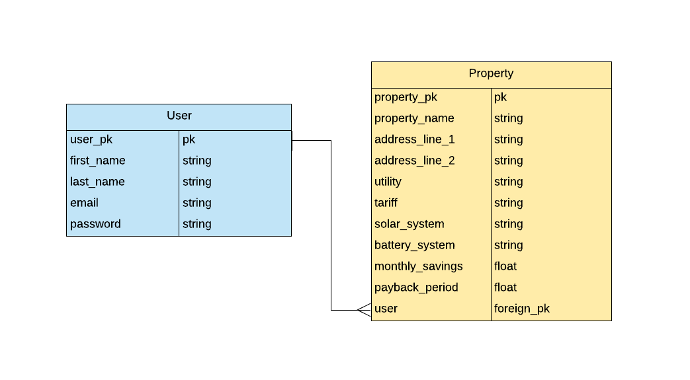
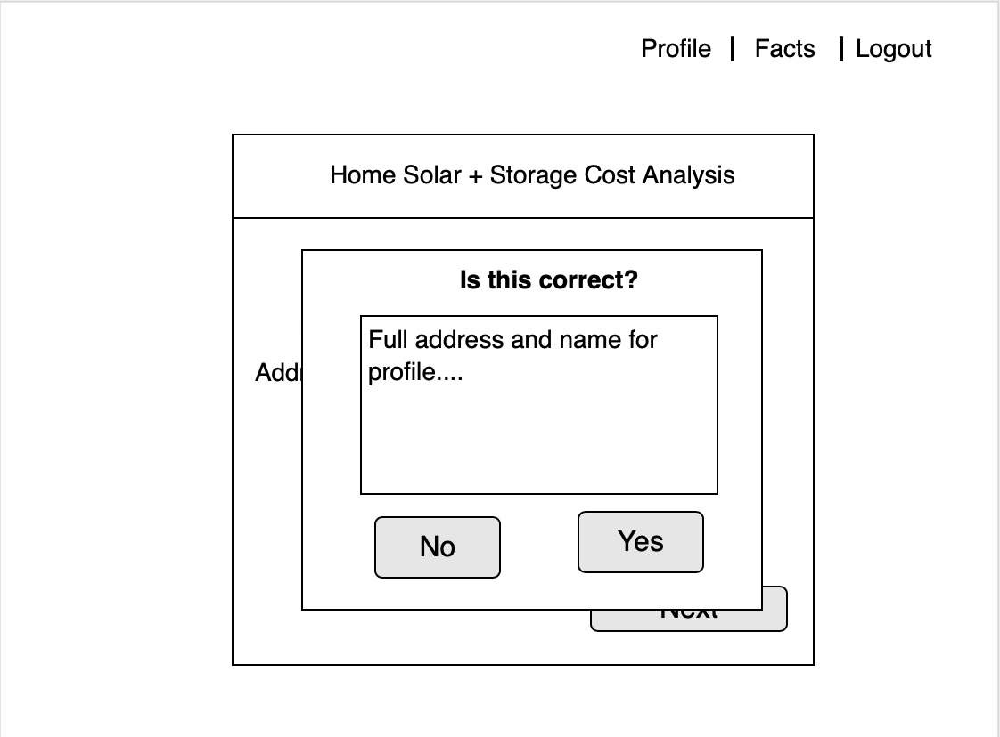
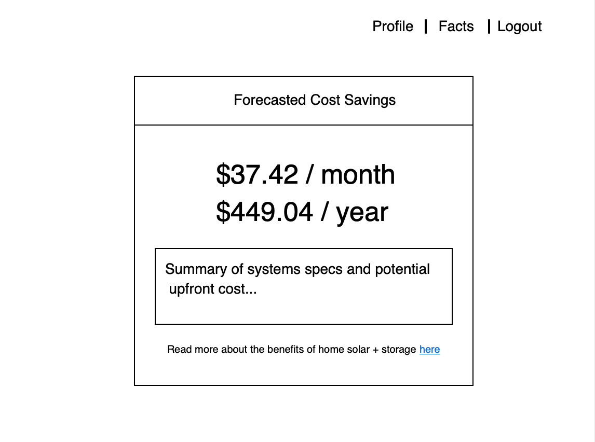

# StoreHouse

A full stack application for property owners to assess potential savings from installing solar and storage technologies. My capstone project for General Assembly's Software Engineering Immersive, June-September 2019.

## Heroku Deployment

https://storehouse-app.herokuapp.com

### Technologies Used

###### Backend
- Python
- Flask
- PostgreSQL
- OSESMO (Open Source Energy Storage Optimization Model) https://github.com/RyanCMann/OSESMO
- PVWatts (Solar PV calculator) https://pvwatts.nrel.gov
- Genability Switch (Utility/tariff information and cost-savings calculator) https://www.genability.com/switch/

###### Frontend
- React
- React-Bootstrap
- Axios

### Room for Improvement

- Add front-end form validation to authorization and property specification.
- More robust error handling.
- Allow users to edit properties and receive the updated analysis.
- Display graphical information of hourly solar production, battery operation, and electricity load for a customer property over the course of a typical day.
- Refactor to use Flask-JWT for authentication so the app stops running into problems with browsers (e.g. Safari, Chrome on iOS) blocking cross-site authentication cookies from the API server.
- Integrate the customer tariff information from Genability with OSESMO to optimize battery usage based on the customer's actual tariff instead of a generic one.
- Update the tariff used in the cost-savings calculation. Currently this is the same as is specified by the user, but in most cases customers are not eligible to use the same tariff after installing solar and storage. This will involve allowing users to select their post solar/storage tariff or automating this process.

---

## Planning materials

### User Description

Home and business owners in California that are interested in understanding the cost/benefits of installing clean tech on their property(ies).

### User Story

1. (If not already logged in) Users arrive at the landing page, where they are directed to create an account or login. After creating an account they are directly logged into the system.
2. From the logged in page users can view their previously quoted properties or proceed to add a new property.
3. Click on a property brings up it's view in a modal, with more detail.
User proceeds through the onboarding process:
4. When a user clicks to add a new property, they are walked through the onboarding process:

- Enter their address
- Confirm utility and tariff status, or select from a list
- Enter last 3 months electricity bills
- Select solar system
- Select storage system
- Confirm submit

5. User is presented with the results of cost savings/per month, as well as the simple payback period of the system.

### Entity Relationship Diagram

### Wireframes

###### Landing

###### Specification

###### Savings Presentation

&copy; Jackson Herron 2019
